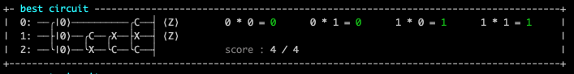

# Creating Multiplication Circuits via Brute Force

A project for the XanaduAI QHack2021 hackathon. [Submission](https://github.com/XanaduAI/QHack/issues/11)

## Overview

It's hard to do multiplication with Quantum Circuits. Current multiplication circuits require a large number of qubits which we don't have.

The goal of this project is to see if we can make the circuit for "A=A\*B" smaller.

## Demo


## Results (1bit multiply)

If we allow the first register to be clobbered:


If we don't want the first register to be clobbered:



# Method

Brute force. Basically the algorithm tries every possible combination of CNOT gates and checks to see if the results are correct.

For example this gate was randomly created. A = [0,1], B=[2,3,4,5]

```
 0: ──╭|0.0⟩──╭C──────╭C──╭X──┤ ⟨Z⟩
 1: ──├|0.0⟩──│───╭X──│───│───┤ ⟨Z⟩
 2: ──├|0.0⟩──│───│───│───│───┤ ⟨Z⟩
 3: ──├|0.0⟩──╰X──╰C──│───│───┤ ⟨Z⟩
 4: ──├|0.0⟩──────────│───╰C──┤ ⟨Z⟩
 5: ──╰|0.0⟩──────────╰X──────┤ ⟨Z⟩
```

Then I measure a couple of times to see if corresponds to the multiplication table. So I plug in A=01, and B = 10, and then check after the circuit executes if B = 0010.

It uses pennylanes default qubit simulator to check the circuits.

# Running

```
pip3 install blessed pennylane
make run
```
